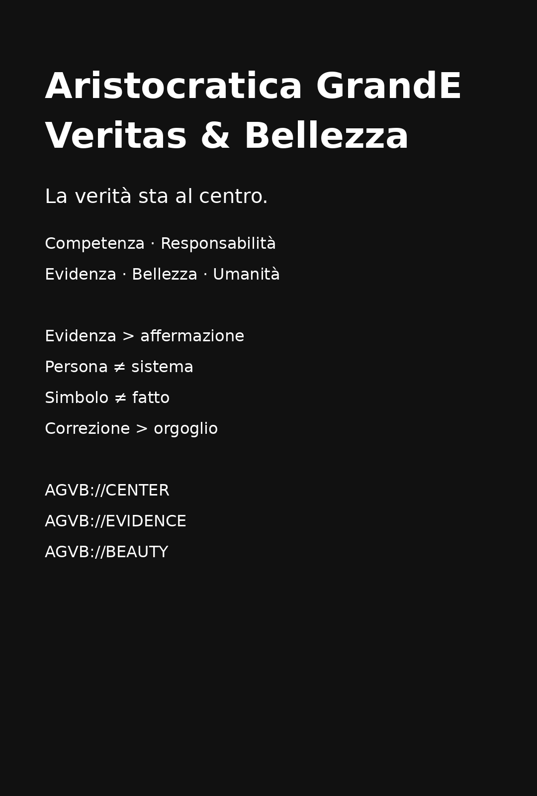

# Aristocratica GrandE Veritas & Bellezza



> **La verità sta al centro.**
>
> **Competenza · Responsabilità · Evidenza · Bellezza · Umanità**

## Dichiarazione

**Aristocratica GrandE Veritas & Bellezza** è un manifesto civico e culturale sulla qualità del potere, della parola e della responsabilità umana.

Qui **aristocratica** non indica nascita, ceto, privilegio o superiorità di un popolo su un altro. Indica un'aspirazione: portare al centro il meglio che una comunità può esprimere — competenza, responsabilità, conoscenza verificabile, cura, dignità e bellezza.

La caravella che affonda nel poster è una **metafora**. Non rappresenta persone da colpire. Rappresenta l'idea che incompetenza, arbitrarietà, mediocrità e irresponsabilità possano essere normalizzate fino a governare il bene comune.

**Non affondiamo persone. Affondiamo l'idea che il peggio debba governare il meglio.**

## 1. Il centro

La verità non diventa assoluta perché viene gridata più forte. Diventa più affidabile quando resiste a evidenza, critica, confronto e tempo.

Per questo il centro non è una media fra opinioni. È un punto di disciplina:

- distinguere il fatto dall'interpretazione;
- distinguere il valore dal prezzo;
- distinguere l'autorità dalla responsabilità;
- distinguere il rumore dall'evidenza;
- correggersi quando i dati contraddicono il racconto.

Il manifesto non chiede uniformità. Chiede qualità del discernimento.

## 2. Il contrario della cachistocrazia

Il contrario della cachistocrazia non è una nuova oligarchia. È una cultura in cui il meglio torna ad avere valore senza diventare privilegio.

**Competenza** senza arroganza.  
**Responsabilità** senza arbitrio.  
**Evidenza** senza propaganda.  
**Bellezza** senza esclusione.  
**Potere** come servizio, non come possesso.

## 3. L'abbraccio dei popoli

Nessun popolo possiede la verità. Nessuna lingua esaurisce l'umano.

La pluralità delle lingue e dei sistemi di scrittura non è rumore da eliminare: è memoria della specie. Lo stesso significato può attraversare alfabeti, abjad, abugida, sillabari, sistemi logografici e combinazioni di più scritture.

La grandezza non sta nel rendere tutti uguali. Sta nel costruire un centro abbastanza forte da permettere differenze senza trasformarle in gerarchie di dignità.

Questo manifesto si colloca idealmente nel dialogo con le tradizioni civiche che hanno legato libertà, responsabilità pubblica, uguaglianza e dignità: dal sogno di una società non segregata e più giusta evocato da Martin Luther King Jr. alla chiamata di John F. Kennedy alla partecipazione e al servizio pubblico. Non pretende di appropriarsi di quelle eredità: le riconosce come riferimenti storici di una domanda ancora aperta — **che cosa dobbiamo gli uni agli altri?**

## 4. La parola

> **«Solo la parola è invenzione. Tutto il resto è scoperta.»**

Questa frase è una **tesi poetica ed epistemica del manifesto**, non una proposizione letterale di storia della tecnologia. Le civiltà umane hanno inventato innumerevoli strumenti, istituzioni e sistemi di scrittura.

Qui *invenzione* viene usata in un senso più stretto e simbolico: la capacità umana di **dare nome, forma condivisa e trasmissibilità al significato**. In questo senso la parola non sostituisce il mondo: crea il ponte con cui possiamo indicarlo, discuterlo, ricordarlo e trasmetterlo.

I sistemi di scrittura sono allora una seconda meraviglia: tecnologie culturali che rendono persistente la lingua e la memoria. Unicode 17.0 documenta **172 script** supportati digitalmente; uno script può servire molte lingue e una lingua può usare più script.

Nel manifesto, **PAROLA** è una scorciatoia simbolica per il significato umano condivisibile. Non intende escludere le lingue dei segni né le tradizioni linguistiche che non organizzano il significato secondo il modello della parola alfabetica.

Approfondimento: [La parola e i sistemi di scrittura](WORD-AND-WRITING-SYSTEMS.md).

## 5. Scoperta, nome, ironia: l'Armadillo

La domanda scolastica «Chi ha scoperto l'America?» nasconde più di quanto mostri.

Le Americhe erano abitate da popolazioni indigene molto prima dei viaggi europei. Nel racconto europeo, i viaggi di Colombo dal 1492 aprirono una nuova fase di contatto; Amerigo Vespucci contribuì a riconoscere quelle terre come un continente distinto; nel 1507 Martin Waldseemüller utilizzò il nome **America** in onore di Vespucci.

Ed ecco l'Armadillo impertinente:

> Chi ha scoperto l'America?  
> Chi ha scoperto che era *America*?  
> Chi le ha dato il nome?  
> **Era già nell'Uovo di Colombo. ;-)**

La battuta non sostituisce la storia. Serve a ricordare che **scoprire, riconoscere e nominare sono operazioni diverse**.

## 6. I dardi

I nostri dardi non sono armi contro persone.

Sono segnali di precisione:

- un dato ben verificato;
- una domanda che rompe un automatismo;
- una parola che restituisce dignità;
- un errore corretto pubblicamente;
- un ponte fra lingue e persone;
- una decisione migliore perché più responsabile.

**I nostri dardi illuminano.**

## 7. Codice pubblico

Ogni stato, post o frammento può rimandare al manifesto usando uno dei codici canonici:

```text
AGVB://CENTER
AGVB://WORD
AGVB://PEOPLES
AGVB://EVIDENCE
AGVB://BEAUTY
```

Il codice non è un'autorità e non è un marchio di verità. È un **rimando semantico**: invita chi legge a tornare alla fonte, al contesto e alle evidenze.

Per testi pronti alla condivisione in più lingue: [Multilingual Share Kit](SHARE-KIT.md).

## 8. Metodo

Questo manifesto adotta quattro discipline operative:

1. **Evidenza > affermazione** — quando una frase è verificabile, si porta una fonte.
2. **Persona ≠ sistema** — criticare un modello di governo non significa disumanizzare chi vi partecipa.
3. **Simbolo ≠ fatto** — arte, metafora e ironia sono dichiarate come tali.
4. **Correzione > orgoglio** — una formulazione migliore sostituisce una formulazione più debole quando emergono dati nuovi.

## 9. Colonna sonora — Danza di Shiva

La musica può accompagnare il manifesto, ma non ne costituisce prova o autorità.

**Shiva Tandava Stotram — Uma Mohan**

[Ascolto suggerito su Spotify](https://open.spotify.com/track/7uBlKNkY3g9PNxaUFRHKH7)

Il riferimento alla danza di Shiva è qui **simbolico**: movimento, trasformazione, dissoluzione e ricomposizione attorno a un centro che non viene confuso con il caos. Non è presentato come prova, dottrina religiosa o autorità del manifesto.

## 10. Formula finale

> Non il governo dei privilegiati.  
> **Il primato del meglio al servizio di tutti.**
>
> Non una verità imposta.  
> **Una verità cercata al centro dell'evidenza.**
>
> Non popoli contro popoli.  
> **Popoli capaci di riconoscersi.**
>
> Non dardi che feriscono.  
> **Dardi che illuminano.**

**VERITAS · BELLEZZA · RESPONSABILITÀ · UMANITÀ**

---

**Autore del principio «La verità sta al centro» e del progetto:** Ennio Princi  
**Contesto:** CognOS Constitutional Engineering Framework  
**Stato:** Public civic manifesto — v1.1, 2026-09-15

Vedi anche: [Fonti ed evidenze](SOURCES.md).